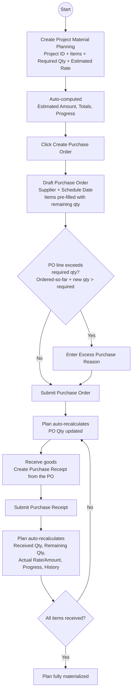

### Rock101 Erp

A construction app that extends ERPNext with project-level material planning. It lets you plan the
quantity and estimated cost of the materials a project needs, then tracks purchasing against that
plan through standard Purchase Orders and Purchase Receipts — complete with progress tracking and
server-side protection against excess purchases.


### Installation

You can install this app using the [bench](https://github.com/frappe/bench) CLI:

```bash
cd $PATH_TO_YOUR_BENCH
bench get-app $URL_OF_THIS_REPO --branch develop
bench install-app rock101_erp
```

**Required before every push:** run the lint fix script from the app root:

```bash
bash scripts/lint-fix.sh
```

## User Guide

This guide explains how to plan materials for a project and how purchasing flows through the app.

### Roles & Permissions

The **Project Material Planning** document can be created and updated by **System Manager**,
**Projects Manager**, **Purchase Manager** and **Purchase User**. All users can view planning records.
Standard ERPNext role checks still apply to Purchase Orders and Purchase Receipts.

### 1. Create a Project Material Planning

1. Go to **Project Material Planning > New**.
2. Fill in the **Project ID** (required, must be unique — it is automatically converted to UPPERCASE).
3. Optionally link the record to an existing ERPNext **Project**, enter the **Project Name**, and set
   **Date Started** / **Expected Date Finished**. (Currency is set automatically from your defaults.)
4. In the **Items** table add each material:
   - **Item** (required) — Item master in ERPNext.
   - **Required Qty** (required) — how much the project needs.
   - **Estimated Rate** — your expected unit purchase price.
   - UOM is filled as needed.
5. **Save**. The following are computed automatically and stored as read-only:

   | Field | Meaning |
   | --- | --- |
   | Estimated Amount | Required Qty × Estimated Rate (per item) |
   | PO Qty | Total quantity on *submitted* Purchase Orders for this item |
   | Received Qty | Total quantity received on *submitted* Purchase Receipts |
   | Remaining Qty | Required Qty − Received Qty (floored at 0) |
   | Excess Qty | Received Qty − Required Qty (floored at 0) |
   | Variance Qty | Received Qty − Required Qty (can be negative) |
   | Exceeded | Checked when Received Qty > Required Qty |
   | Actual Rate | Actual Amount ÷ Received Qty (weighted average) |
   | Actual Amount | Cost of the quantity received |
   | Required / Purchased / Remaining Items | Quantity totals across all items (Purchased = received on submitted receipts) |
   | Total Required / Purchased / Remaining Cost | Cost totals across all items (Purchased = cost of received quantity) |
   | Material Quantity Progress | ΣReceived ÷ ΣRequired × 100 |
   | Material Cost Progress | ΣPurchased Cost ÷ ΣRequired Cost × 100 |
   | Project Progress | Equal to Material Quantity Progress |

6. **Purchase Orders** is a read-only log of every line on *submitted* Purchase Orders linked to
   this plan (date, supplier, PO, status, item, qty, rate, amount). It is rebuilt automatically —
   never edit it manually.
7. **Purchase History** is a read-only log of the plan's transaction lines — both *submitted*
   Purchase Orders (type **PO**) and *submitted* Purchase Receipts (type **PR**) — showing date,
   type, supplier, PO/PR, item, qty, rate, amount and the **Reason** (populated for excess PO lines).
   It is rebuilt automatically — never edit it manually.
8. Use the **Notes** field for anything you want to remember about the plan.

> You can always edit an existing planning document. It has no Submit/Cancel workflow — it is an
> evergreen plan that tracks itself from the purchasing transactions.

### 2. Create a Purchase Order

There are two ways:

#### A. From the planning document (recommended)

1. Open the **Project Material Planning** record.
2. Click **Create Purchase Order** (button at the top-right of the document toolbar).
3. In the dialog choose a **Supplier** (required), an optional **Schedule Date**, and confirm the
   **Items**. Quantities are pre-filled with the **Remaining Qty** of each item (fallback to Required
   Qty); you can adjust **Qty** and **Rate** before creating.
4. Click **Create**. A draft **Purchase Order** is created and linked back to the plan
   (`Project Material Planning` filled on the PO header). The warehouse is taken from the item's
   default warehouse for the PO company.
5. If any quantity in the dialog **exceeds** the plan requirement (already ordered + this line),
   a **confirmation dialog** appears first, listing each exceeding line with its Required,
   Already Ordered, New Total and Excess quantities. Choosing **Proceed** requires an
   **Excess Purchase Reason** (mandatory prompt) before the order is created.
6. Review and **Save/Submit** the Purchase Order as usual.

#### B. Manually (directly in the Purchase Order)

1. Create a **Purchase Order** and set **Project Material Planning** on the header.
2. On each item row, fill **Project Material Planning Item** with the matching row of the plan.

   > This field is a link to the **Project Material Planning Item** child row, so make sure it
   > belongs to the plan referenced in the header. The app rejects lines that don't match.

### 3. Excess Purchase protection

When you order more than the plan requires (already ordered + this line), a **confirmation dialog**
asks whether you want to proceed, showing the required qty, already-ordered qty and the excess. If you
choose **Proceed**, you **must type an Excess Purchase Reason** (small text field, shown on the PO
item row) before the reason is recorded. On the server:

- **Exceeds Project Requirement** and **Excess Quantity** on the PO line are computed read-only.
- If a line exceeds the requirement without a reason, saving/submitting is **blocked** with a clear
  error. You can buy extra, but you must record why.

### 4. Receive materials (Purchase Receipt)

1. Create a **Purchase Receipt** from the submitted Purchase Order (standard ERPNext).
2. The **Project Material Planning Item** link on each receipt line is **inherited automatically**
   from the Purchase Order line.
3. **Submit** the receipt. The plan updates instantly:
   - Received Qty, Actual Rate/Amount, progress, and Purchase History reflect the delivered goods.
   - **Purchased Items** and **Total Purchased Cost** only count here — a purchase is "recognized"
     when the stock is actually received, not when the PO is placed. Ordering shows up on the
     **Purchase Orders** table and per-item **PO Qty**.
   - Receiving **more than planned is not blocked** — it is tracked as **Excess Qty** on the plan so
     managers see it. The PO-level validation prevents over-ordering in the first place.

### 5. Cancelling and totals

- Cancel or Amend the Purchase Order / Purchase Receipt; the plan is recalculated from the
  submitted documents (a receiving cancel **reverse**s the quantities automatically).
- The plan read-only fields are always derived from the submitted transactions — never edited.

## Workflow Process



The flow is a closed loop — **plan → order → receive → auto-update — until every item is received**. Key points:

- Every change (PO/PR **submit** or **cancel**) triggers a full recalculation from the submitted
  source transactions, so totals can never drift out of sync.
- Excess is prevented at the **ordering** stage (reason required for submission) and only *tracked*
  at the **receiving** stage.
- The plan document is always editable; nothing needs Submit/Amend on the plan itself.

### Contributing

```bash
cd apps/rock101_erp
pre-commit install
```

Pre-commit is configured to use the following tools for checking and formatting your code:

- ruff
- eslint
- prettier
- pyupgrade

### CI

This app can use GitHub Actions for CI. The following workflows are configured:

- CI: Installs this app and runs unit tests on every push to `develop` branch.
- Linters: Runs [Frappe Semgrep Rules](https://github.com/frappe/semgrep-rules) and [pip-audit](https://pypi.org/project/pip-audit/) on every pull request.


### License

mit
